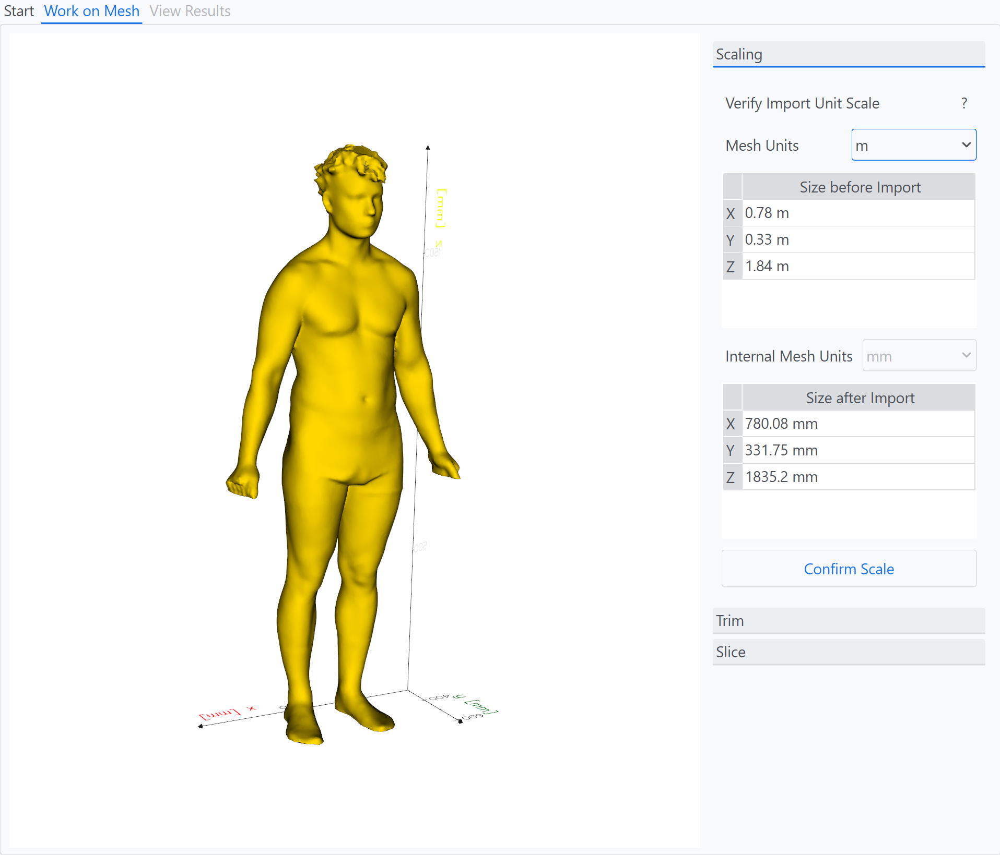
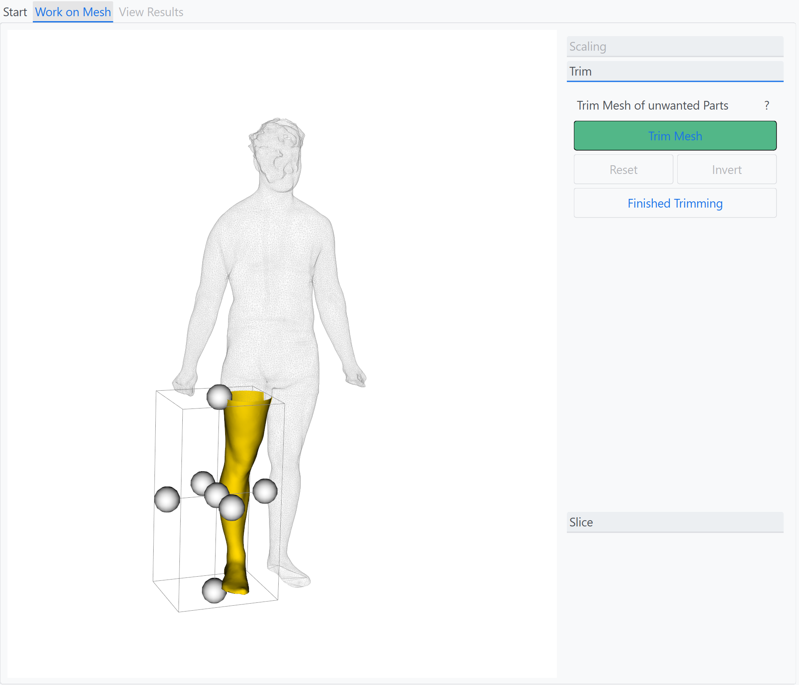
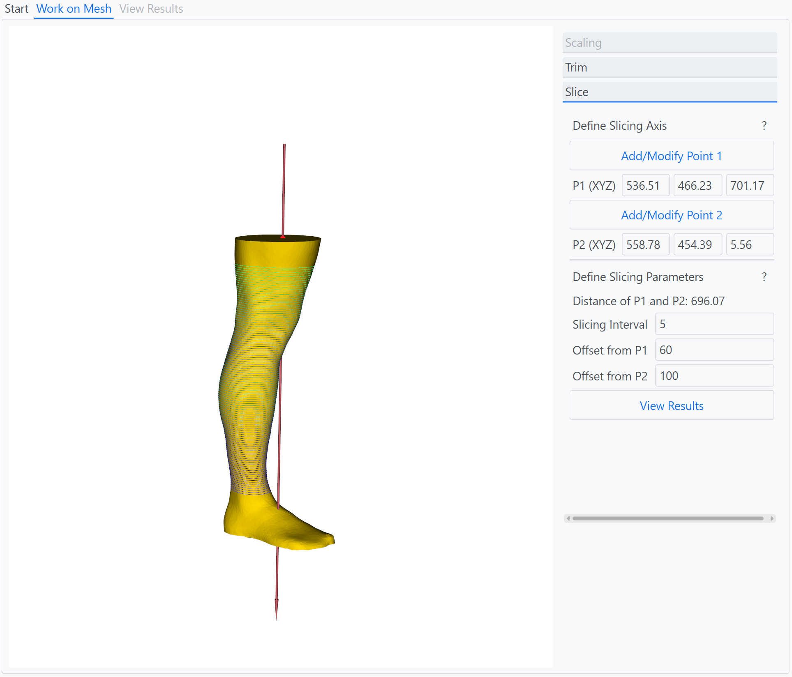
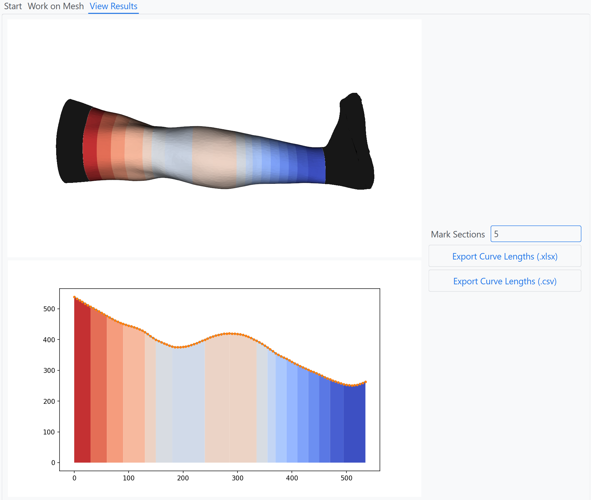

# SliceTool - A tool for slicing 3D-Objects

## About
Slice Tool is a utility for easy and quick creation of many equidistant slices of the surface of a 3D object. It was made to assist textile researchers working with 3D scans of human bodyparts, e.g. when designing compression socks.

## Usage
The usage is demonstrated in a a short video (Clicking on the thumbnail will open the video on YouTube).

## Features

<h3>Scale the Mesh</h3>

Different unit systems are a common issue when working with 3D scans. Slice tool has a built in utility to help you easily select the correct scale.

<h3>Trim the Mesh</h3>

This feature allows you to trim parts from the mesh that are not important for your use case.

<h3>Slice the Mesh</h3>

The main feature of Slice Tool is a slicing utility that is easy and intuitively to use. You may select two points on the mesh by cicking on it to create an axis along which the slicing shall take place. Then you enter the slicing intervall. Additionally, you may define an offset trom the points to exclude parts you dont want to slice.

<h3>Display & Export Results</h3>

After entering the slicing data, the circumference and position of every slice is computed. You may export it to excel or csv. Additionally, you can group the slices into sections with a similar circumperence by defining a treshhold [%]. 

## Installation
First, download this repository and unpack it. Notice that the folder must be on your local harddrive.

1) Create a virtual environment in the folder. Python 11.9 is recommended.
2) Install the requirements by calling 'pip install -r requirements/common.txt'.
3) **IMPORTANT:** SliceTool uses the vedo library (https://github.com/marcomusy/vedo). Certain bugfixes of that package which are necessary for SliceTool to properly function are not included in its currently most recent version (2025.5.4) on PyPi. Instead, please download the vedo package directly from its repository and replace the vedo folder in your repository by it. 
   

   
